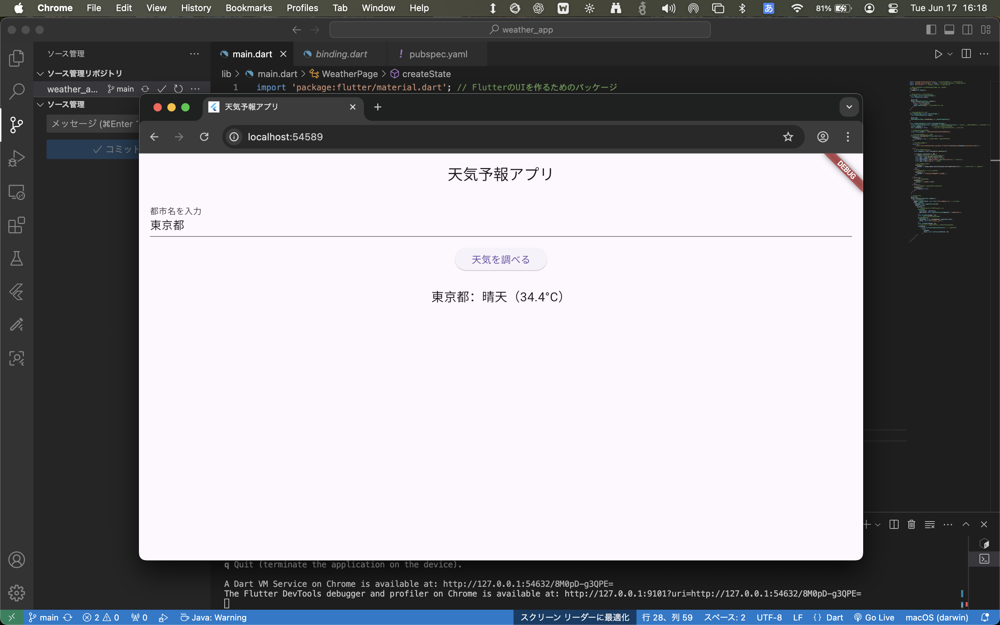

# 🌤️ Flutter 天気予報アプリ

Flutterで作成した、都市名を入力して天気情報を取得・表示する天気予報アプリです。

---

## 📱 主な機能

- 都市名を入力して現在の天気を表示
- アイコン付きの天気情報
- API取得中はローディング表示
- 日本語表記対応（必要に応じて）

---

## 🔧 使用技術

| 種別 | 技術 |
|------|------|
| 言語 | Dart |
| フレームワーク | Flutter |
| API | [OpenWeatherMap API](https://openweathermap.org/api) |
| IDE | VSCode |

---

## 🧠 工夫した点

- 天気取得中は `CircularProgressIndicator` を表示
- APIレスポンスのステータスコードチェックと例外処理
- UIとロジックを分離した構成
- ユーザー入力バリデーション（空文字・無効都市など）

---

## 💻 画面イメージ

| 入力画面 | 結果表示画面 |
|----------|--------------|
|  |  |

※ `screenshots/` フォルダを作って画像を入れておくと表示されます。

---

## 🚀 今後のアップデート予定

- 現在地の天気取得（位置情報対応）
- 一週間の天気予報表示
- ダークモード対応
- Firebaseとの連携（サインイン・お気に入り都市の保存）

---

## 🏁 実行方法

```bash
flutter pub get
flutter run
